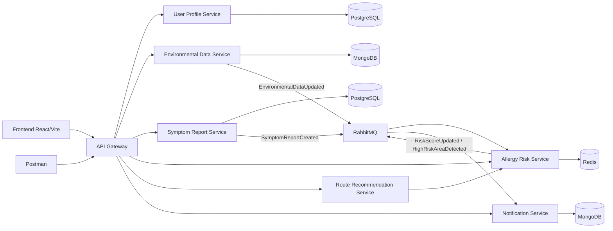
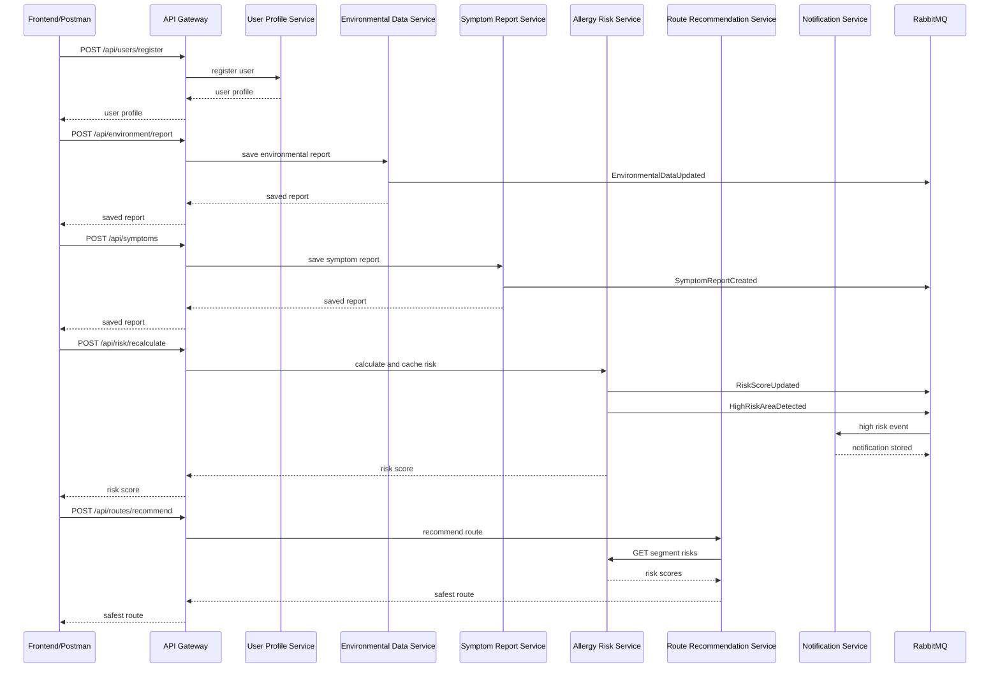

# PollenShield Architecture

## High-Level Description

PollenShield is a microservice-based allergy risk prediction and safer route recommendation platform. Clients use a React frontend or Postman to call the API Gateway. The gateway routes requests to independent backend services. Services use REST for synchronous interactions and RabbitMQ for asynchronous event communication.

## Microservice Decomposition

| Service | Responsibility | Port |
| --- | --- | --- |
| API Gateway | Single entry point, request routing, proxy logging, timeouts | 3000 |
| User Profile Service | User registration, login, allergy profile, preferences | 3001 |
| Environmental Data Service | Environmental report storage and environmental events | 3002 |
| Symptom Report Service | Symptom report storage and symptom events | 3003 |
| Allergy Risk Service | Deterministic risk calculation, Redis caching, risk events | 3004 |
| Route Recommendation Service | Mock route generation and safest route selection | 3005 |
| Notification Service | High-risk alert storage and notification read state | 3006 |
| Frontend | React demo console | 5173 |

## Database Per Service

| Service | Database | Reason |
| --- | --- | --- |
| User Profile Service | PostgreSQL | Structured user/profile records |
| Symptom Report Service | PostgreSQL | Structured user-location reports |
| Environmental Data Service | MongoDB | Flexible environmental observation documents |
| Notification Service | MongoDB | Alert/notification documents |
| Allergy Risk Service | Redis | Fast cache for calculated risk scores |
| Route Recommendation Service | None | Stateless route comparison |
| API Gateway | None | Routing only |

## REST Communication

| Source | Target | Purpose |
| --- | --- | --- |
| Frontend/Postman | API Gateway | All client requests |
| API Gateway | User Profile Service | `/api/users/*` |
| API Gateway | Environmental Data Service | `/api/environment/*` |
| API Gateway | Symptom Report Service | `/api/symptoms/*` |
| API Gateway | Allergy Risk Service | `/api/risk/*` |
| API Gateway | Route Recommendation Service | `/api/routes/*` |
| API Gateway | Notification Service | `/api/notifications/*` |
| Route Recommendation Service | Allergy Risk Service | Fetch segment risk scores |

## Event Communication

| Event | Producer | Consumer | Purpose |
| --- | --- | --- | --- |
| `EnvironmentalDataUpdated` | Environmental Data Service | Allergy Risk Service | Trigger risk updates from pollen/weather data |
| `SymptomReportCreated` | Symptom Report Service | Allergy Risk Service | Trigger risk updates from user symptoms |
| `RiskScoreUpdated` | Allergy Risk Service | Future consumers | Announce recalculated risk |
| `HighRiskAreaDetected` | Allergy Risk Service | Notification Service | Store alert notifications |
| `NotificationRequested` | Future producers | Notification Service | Generic notification request event |

## Main Demo Flow

1. Register demo user.
2. Login and fetch profile.
3. Submit environmental report.
4. Submit symptom report.
5. Recalculate risk.
6. Fetch cached risk and forecast.
7. Recommend safer route.
8. Fetch notifications and mark one as read.

## Architecture Diagram

## Demo Sequence Diagram

